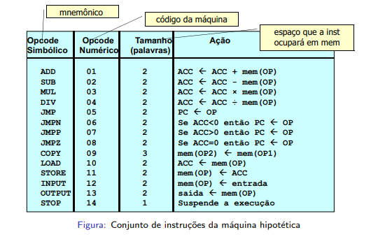

# Visão Geral
Estudante: Belphy Pierre Starling 

Matrícula: 202006420

Esse projeto consiste realizar um montador e um ligador de um assembly inventado visto na aula de Software Básico na Universidade de Brasília.

Primeiramente, compila-se o projeto por meio do comando `make`.

Para implementar o projeto, utilizou-se o Windows com o terminal do Ubuntu por meio do WSL (Windows Subsystem for Linux)

O assembly inventado consiste das seguintes instruções:

# Pre-processamento
Responsável por:
- Ignorar os comentários
- Ignorar espaços em branco desnecessários
- Transformar tudo em CAPS LOCK com o intuito de não ser 'Case Sensitive'
- Colocar o conteúdo do SECTION DATA após o SECTION TEXT
- Processar macros (espera-se que as macros estejam sempre no inicio do arquivo, antes do BEGIN e do SECTION TEXT)

# Montador

Permite transformar um arquivo .asm em .pre realizando o pré-processamento, por meio do comando `./montador [nome_do_arquivo].asm`

Além disso, permite transformar .pre em .obj, por meio do algoritmo de duas passagens, por meio do comando `./montador [nome_do_arquivo].pre`

Caso o arquivo .pre possui 'BEGIN' e 'END', deverá conter a tabela de usos, tabela de definições, vetor de relativos e o código gerado para ser ligado posteriormente.

Caso contrário, deverá apenas conter o código gerado.

Exemplo de .pre com 'BEGIN' e 'END' após ser montado:

D, [nome_da_label] [endereço_de_declaracao_da_label]   -> Cada linha iniciada por 'D, ' representa uma linha da tabela de definições

U, [nome_da_label] [endereco_de_uso_da_label]   -> Cada linha iniciada por 'U, ' representa uma linha da tabela de uso

R, 0 1 ...   -> Nessa linha iniciada por 'R, ' contém valores binários, representando se o i-ésimo endereço é um valor relativo (1) ou valor absoluto (0)

2 17 ...   -> Na última linha contém o código gerado.

# Ligador

O ligador aceita de 2 até 5 arquivos .obj para serem ligados, resultando em um único arquivo `[nome_do_primeiro_arquivo_obj].e`

Para utiliza-lo, digite o comando `./ligador [nome_do_arquivo1].obj [nome_do_arquivo2].obj`

A ligação ocorre de maneira sequencial á ordem dos arquivos passados como parâmetro.

